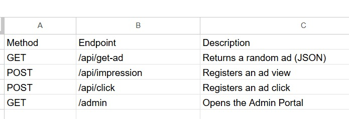
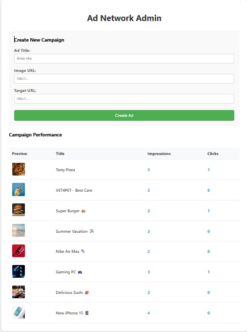
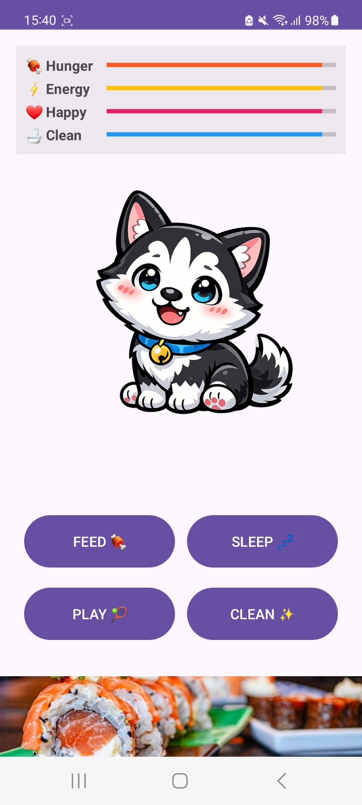

# HuskyGotchi Ad Network SDK

HuskyGotchi Ad Network is a complete advertising ecosystem consisting of a Cloud Server, an Android SDK, and a Demo Application.

## Project Resources

* **GitHub Repository:** [Link to Code](https://github.com/MaayanSandak/HuskyGotchi-project)
* **Admin Portal (Live):** [Link to Admin Panel](https://huskygotchi-project.onrender.com/admin)
* **Server API:** [Link to Server](https://huskygotchi-project.onrender.com)

---

## Architecture

1.  **Android SDK (`MyAdSDK`):** A library that fetches and displays ads.
2.  **Server (Python/Flask):** Manages ad logic and serves data from MongoDB.
3.  **Database (MongoDB):** Stores campaigns, impressions, and clicks.
4.  **Admin Portal:** Web interface for managing ad campaigns.

---

## SDK Installation

To use the SDK in another Android project:

**Step 1. Add JitPack to `settings.gradle.kts`:**
```kotlin
dependencyResolutionManagement {
    repositoriesMode.set(RepositoriesMode.FAIL_ON_PROJECT_REPOS)
    repositories {
        google()
        mavenCentral()
        maven { url = uri("[https://jitpack.io](https://jitpack.io)") }
    }
}

Step 2. Add the dependency to build.gradle.kts:
dependencies {
    implementation("com.github.MaayanSandak:HuskyGotchi-project:v1.0")
}

Usage Example
Add the BannerAdView to your XML layout:
<com.example.myadsdk.BannerAdView
    android:id="@+id/bannerAd"
    android:layout_width="match_parent"
    android:layout_height="wrap_content" />

## Screenshots

### API Endpoints



### Admin Portal



### Android App


